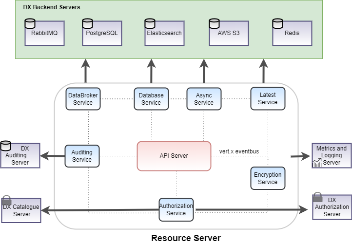

%20pipeline/lastBuild/)
%20pipeline/lastBuild/jacoco/)
%20pipeline/lastBuild/testReport/)
%20pipeline/lastBuild/performance/)
%20pipeline/lastBuild/zap/)
%20pipeline/Integration_20Test_20Report/)

# DX Resource Server

The DX Resource Server serves as the data plane for datasets, enabling data discovery, publication, and subscription. 
It facilitates data providers in publishing their resources based on annotated metadata and allows consumers to access 
data in accordance with the provider's access policies. The server ensures secure data access by integrating with 
an authorization server, requiring consumers to present access tokens validated through token introspection APIs before
serving protected data. Additionally, the resource server offers an interface with a data broker for streaming data ingestion and subscription via AMQPs. It also supports advanced search functionalities like temporal, geo-spatial and attribute queries through an HTTPs API interface. Data Providers can publish the data and Consumers can access/consume the data using both HTTPs and AMQPs protocols.

## Features

- Provides data ingestion and data access from available resources using standard HTTPs APIs, AMQPs streaming 
- Search and count APIs for searching through available data: Support for Spatial (Circle, Polygon, Bbox, Linestring), Temporal (Before, during, After) and Attribute searches
- Adaptor registration endpoints and streaming endpoints for data ingestion
- Integration with authorization server (token introspection) to serve protected data as per the access control policies set by the provider
- End to End encryption for data access using certificate for HTTPs
- Secure data ingestion and data access over TLS for HTTP and AMQP
- Scalable, service mesh architecture based implementation using open source components: Vert.X API framework, Elasticsearch/Logstash for database and RabbitMQ for data broker.
- Hazelcast and Zookeeper based cluster management and service discovery
- Integration with auditing server for metering and accounting purpose

# Explanation
## Understanding Resource Server
- The section available [here](./docs/Solution_Architecture.md) explains the components/services used in implementing the Resource Server
- To try out the APIs, import the API collection, postman environment files in postman
- Reference : [postman-collection](src/test/resources/IUDX-Resource-Server-Consumer-APIs-V5.5.0.postman_collection.json), [postman-environment](src/test/resources/IUDX-Resource-Server-Consumer-APIs-V5.5.0.postman_collection.json)

# How To Guide
## Setup and Installation
Setup and Installation guide is available [here](./docs/SETUP-and-Installation.md)

# Reference
## API Docs
API docs are available [here](https://redocly.github.io/redoc/?url=https://raw.githubusercontent.com/datakaveri/iudx-resource-server/master/docs/openapi.yaml)

## FAQ
FAQs are available [here](./docs/FAQ.md)
